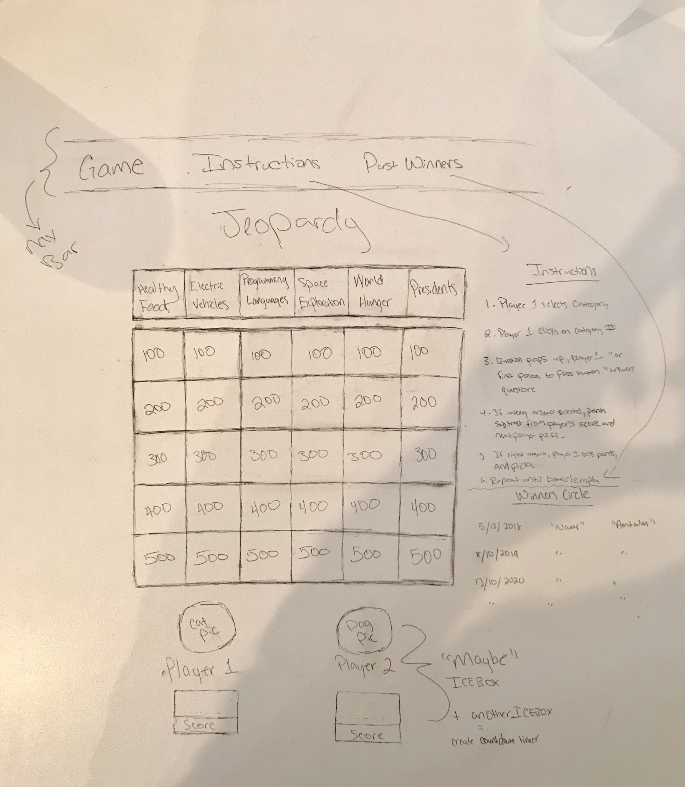

<h1>Jeopardy Project</h1>
 
<h2>Overview</h2>

Here I created a multi player jeopardy game that pertains to questions of subjects relating to modern day importance: which includes software development questions, electrical & self-driving vehicle questions, world hunger & healthy foods, space exploration, and presidents.

These subjects interest me as I value the importance of providing exponential value to everyday society and furthering the developent of the world. 

 Player 1 and Player 2 each choose whether they want to be President Obama or President Trump (our latest 2 Presidents- having no preference). Then the fun begins! Questions include subjects including electrical vehicles(EV), space exploration, world hunger, healthy foods, and programming languages.

 

<h3>Technologies Used</h3>
<ul>
<li>HTML- imported bootstrap, connected javascript and jquery files, styled webpages, and created elements for my table and players score, while creating a navigation bar</li>
<li>CSS- used bootsrap mostly to style, but normal css to override some</li>
<li>Javascript- to call on and click my boxes while returning questions, input, and output</li>
<li>J Query- to call on and click my boxes, while returning questions, input, and output</li>
<li>Bootstrap- styled table and navigation header </li>
<li>VS Code- my development environment</li>
</ul>
 

<h3>Wireframe<h3>

**Actually went a little farther than my wireframe to create an entire page for instructions, but didnt include 'past winners' yet

 
<h3>PLAY BELOW!</h3>
<a href="https://world-jeopardy.netlify.com/">Live Project Link</a>
 
<a href="https://trello.com/invite/b/daYBgKWq/ce7d3be4278d4e69b33450ae819a72a8/jeopardy-game-creation">My Trello Link</a>
 

<h3>New Features<h3>
<ul>
<li>Players each press a separate key to see who can answer the question first</li>
<li>More than 2 Players</li>
<li>3D interactivity</li>
</ul>