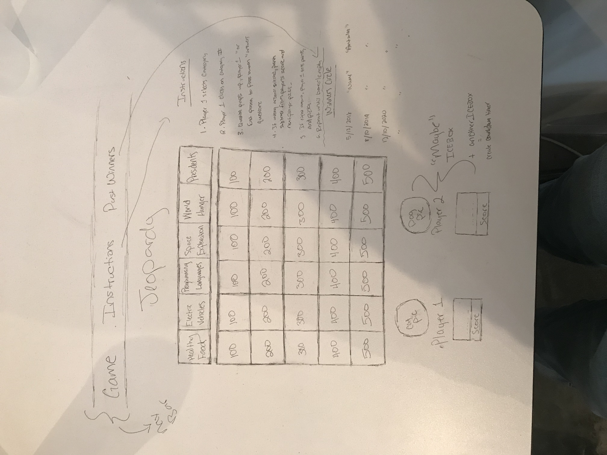

<h1>Jeopardy Project</h1>
 
<h2>Overview</h2>

Here is my first General Assmebly project. I created a Jeopardy board game that allows multiple players and has questions pertaining to subjects of modern day importance, in which what I feel even the Presidents need to know to further our world.

 

 Player 1 and Player 2 each choose whether they want to be President Obama or President Trump (our latest 2 Presidents). Then the fun begins! Questions include subjects including electrical vehicles(EV), space exploration, world hunger, healthy foods, and programming languages.

 
<h3>Technologies Used</h3>

HTML

CSS

Javascript

J Query

Bootstrap

VS Code

 
<h3>Wireframe<h3>

 
<h3>Live Project</h3>
<a href="http://frosty-babbage-58293a.netlify.com/">link text</a>

